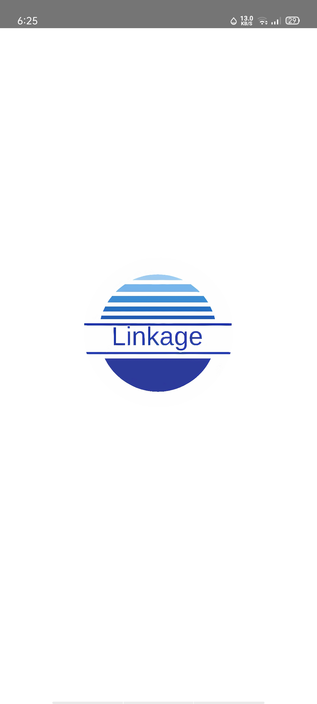
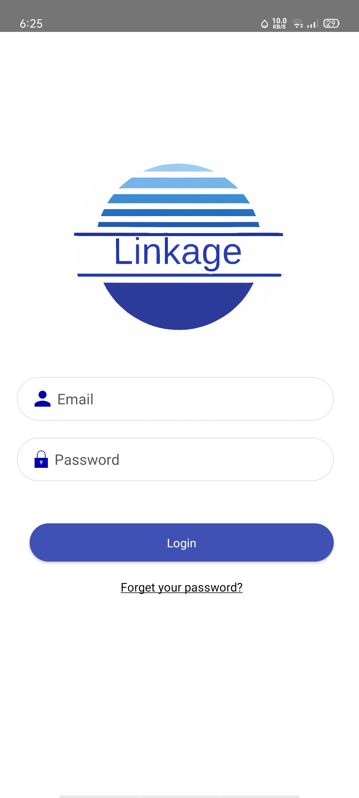
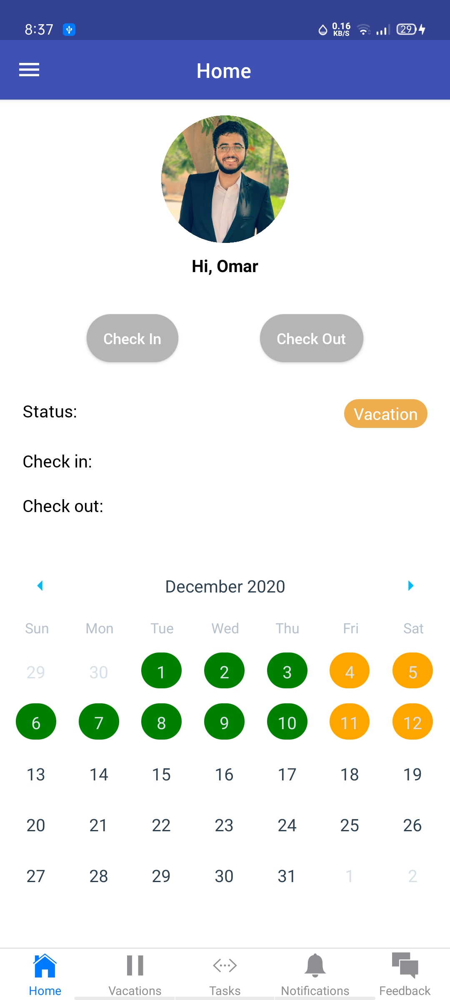
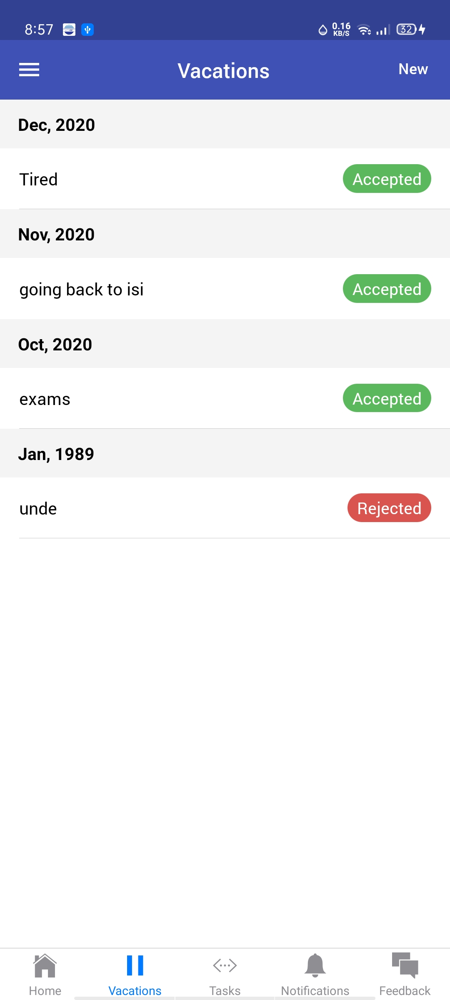
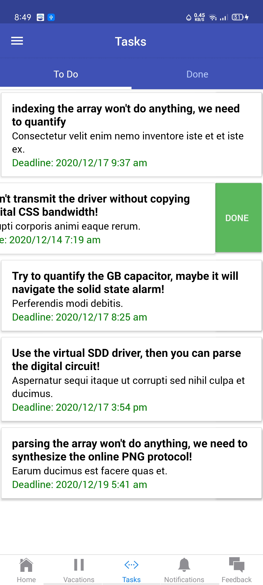
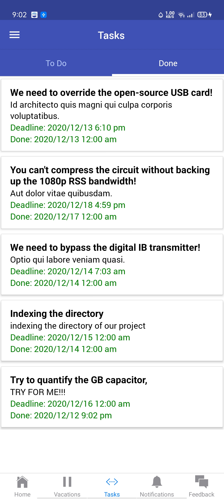
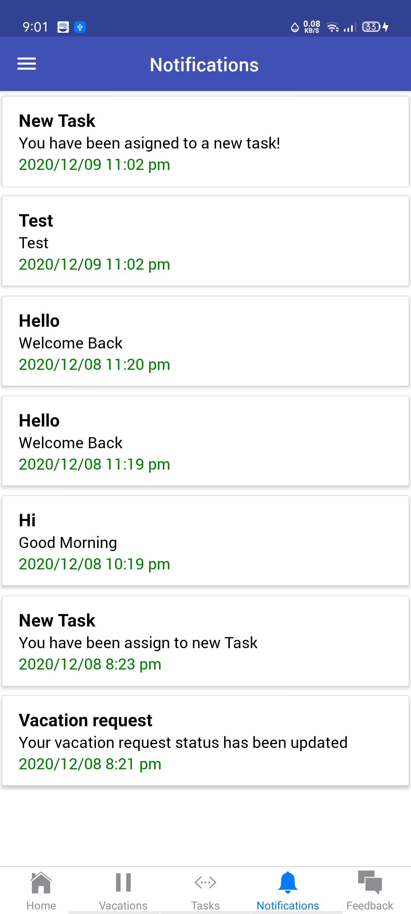
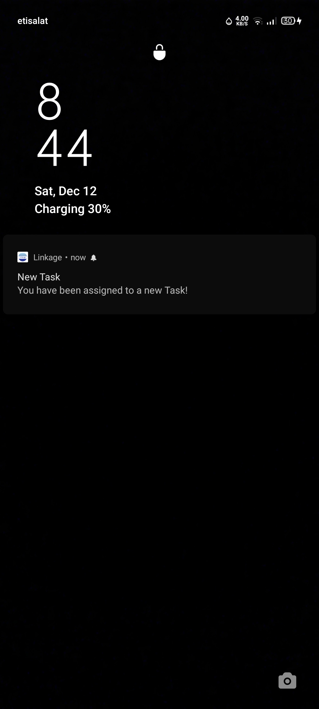
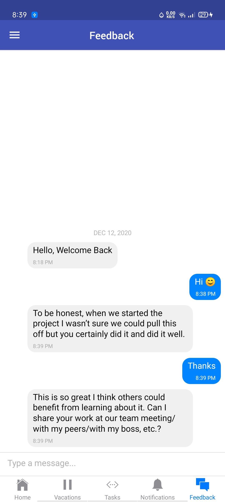

  

   

## Overview
  A HR System that allow track attendacne, tasks and vacations of the employee of the company. The system consists of two main parts. First one is the mobile application for the employee, other one is a website for HR manager.

## Mobile Application Features

* Employee can check-in and check out through the mobile app.
* Employee can request vacations, see their status, and view their vacation history through the year.
* Employee can receive general tasks over their mobile app and mark them as done.
* Employee can receive general and specific notifications about their tasks and vacation requests status.
* Employee can receive feedback from Hr in real-time chat.

## Web Application Features

* HR can add new employees to the system and update their profiles.
* HR can view the attendance of all employees.
* HR can view and respond to all vacation requests of the employee with acceptance or rejection with notes.
* HR can view, assign tasks to the employee and update them.
* HR can send notifications to all employees and specific ones too.
* HR can configure some settings like work hours, holidays, and location of the company (Geofence).

## Technology Stack
Module                          |  Technology Stack
----------------------------------|------------------------------------------------------------------------------------
Server                         |  - NodeJS  - Express   - MonogDB   - Firebase
Web Application                |  - ReactJS  - Bootstrap
Mobile Application             |  - React Native
## Mobile Application

  
  
  

  
  
  

  
  
  

## Web Application

 

#### Login Page

 

 

#### Users

 

 

#### New User Form

 

 

#### User Profile

 

 

#### Attendence

 

 

#### Vacations Requests

 

 

#### Vacation Respond Form

 

 

#### Tasks

 

 

#### Notifications

 

 

#### Settings

 

## License

The app is MIT licensed.
